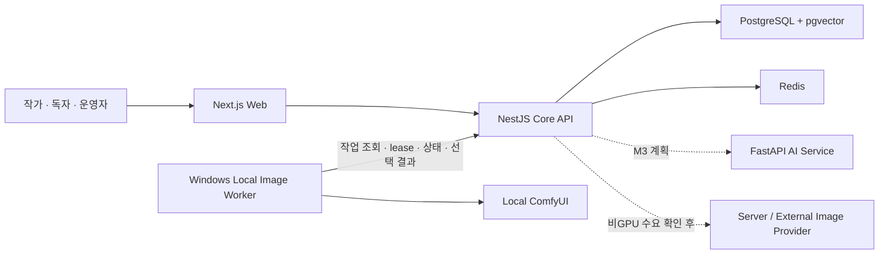

# qqup

> 소설의 원고, 캐릭터 설정과 분기·재합류하는 사건 흐름을 하나의 작업 공간에서 관리하고, 이후 근거 기반 AI 일관성 검사와 로컬 이미지 생성을 연결하는 개인 웹 서비스 프로젝트

이 저장소는 qqup의 공개 포트폴리오다. 실제 제품 소스와 상세 내부 문서는 private 저장소에서 관리하며, 여기에는 공개 가능한 설계 의도, 검증된 진행 상태와 시각 자료만 선별해 기록한다.

아래 프로젝트 전반 현황은 2026-09-04 확인 기록이다. 이후 갱신한 이미지 워커의 최초 등록·요청별 인증·두 개발 서버 연결은 [이미지 워커 연결 흐름](docs/image-worker-connection-lifecycle.md)에 2026-09-13 기준으로 별도 정리했다.

| 항목          | 현재 상태                                                                                 |
| ------------- | ----------------------------------------------------------------------------------------- |
| 프로젝트 단계 | M1 플랫폼 골격·M2 작가 스튜디오 완료, M4 로컬 이미지 생성과 M5 회차 발행 기반 구현        |
| 구현된 기반   | 인증, 작품·회차·자동 저장·수정 이력·고정 발행본, 캐릭터·세계관·사건 DAG, FACE 생성 Worker |
| 다음 목표     | 반응형 독자 뷰어, Mac↔Windows 이미지 생성 E2E와 생성 이미지 공개 승인                     |
| 제품 소스     | private 저장소에서 별도 관리                                                              |
| 외부 데모     | 아직 배포하지 않음                                                                        |
| 상태 확인일   | 2026-09-04                                                                                |

## 해결하려는 문제

장편 소설은 원고만 관리해서는 설정 일관성을 유지하기 어렵다.

- 캐릭터의 외형, 관계와 시간에 따른 상태 변화
- 세계관 규칙, 장소·세력·아이템 설정
- 사건의 실제 발생 순서와 독자에게 서술되는 순서
- 선택에 따라 갈라졌다가 다시 합류하는 사건 흐름
- 과거 회차와 현재 원고 사이의 설정 모순

qqup는 이 정보를 구조화된 데이터와 사건 그래프로 연결한다. 작가는 정확한 날짜가 없는 사건을 상대 순서로, 아직 회차에 배치하지 않은 사건을 미배치 상태로 관리할 수 있다. AI는 원본 설정을 임의로 변경하지 않고 근거가 있는 제안을 제공하며, 최종 결정은 작가가 내리는 방향으로 설계한다.

## 시스템 구성

실선은 현재 구현된 서비스 골격과 데이터 흐름이고, 점선은 후속 마일스톤의 연결 계획이다.



- Web은 Core API만 호출한다.
- Core API가 인증, 작품 접근 권한과 데이터 변경의 최종 판단 주체다.
- AI 일관성 검사는 후속 범위이며, 이미지 생성 결과는 작가가 로컬에서 선택한 뒤 후보로 등록한다.
- 모노레포에서 개발하지만 Web·API·AI는 독립 배포 경계를 유지한다.

자세한 책임과 기술 판단은 [상위 아키텍처](docs/architecture.md)에서 설명한다.

## 현재 구현과 계획의 구분

| 상태      | 범위                                                                                      |
| --------- | ----------------------------------------------------------------------------------------- |
| 구현 완료 | pnpm workspace 모노레포, 독립 빌드 서비스와 PostgreSQL·pgvector·Redis 개발 환경           |
| 구현 완료 | 서버 세션 인증·작품 소유권, 작품·회차 수명주기, Tiptap 자동 저장과 불변 수정 이력         |
| 구현 완료 | 캐릭터·세계관·사건 시간축 DAG, 분기·재합류, 회차 사건 배치와 반응형 작가 화면             |
| 구현 완료 | FACE 생성 작업, outbound polling·lease·재시도, Windows ComfyUI 실행·로컬 선택·후보 업로드 |
| 구현 완료 | 현재 원고를 고정 발행본으로 보존하는 회차 발행·재발행·공개 중단 기반                      |
| 설계 완료 | 운영 DB 분리, Local-first 이미지 실행과 비GPU 사용자를 위한 서버·외부 API 대체 경계       |
| 다음 구현 | 고정 발행본만 조회하는 공개 API와 반응형 독자 뷰어                                        |
| 후속 계획 | Mac↔Windows 실기기 E2E, 이미지 공개 승인, 근거 기반 AI 일관성 검사와 대체 이미지 제공자   |

## AI 보조 개발을 통제하는 방식

Codex를 단순 코드 생성기로만 사용하지 않고, 저장소에 버전 관리되는 작업 계약과 전문 문서를 통해 작업 범위·판단 기준·검증 방식을 통제한다.

```text
private source repository
├── AGENTS.md              # 저장소 공통 작업 계약과 문서 라우팅
├── apps/web/AGENTS.md     # Web 경계·UI·접근성·검증
├── apps/api/AGENTS.md     # API·권한·계약·데이터 변경
└── infra/AGENTS.md        # 로컬 인프라·비밀정보·영속 데이터 안전
```

핵심은 규칙 파일을 많이 만드는 것이 아니라, 공통 규칙과 서비스별 규칙의 책임을 분리하는 것이다. 사용자 제안을 기계적으로 수용하지 않고 현재 마일스톤의 가치, 복잡도, 보안·운영 비용과 가역성을 검토해 대안과 트레이드오프를 함께 제시하도록 구성했다.

설계 배경과 작업 흐름은 [AGENTS.md 계층과 바이브 코딩 운영](docs/vibe-coding-workflow.md)에서 확인할 수 있다. 이 쇼케이스의 `AGENTS.md`는 제품 개발 규칙이 아니라 공개 문서의 사실성과 안전만 관리한다.

## 재현 가능한 개발환경

다중 서비스의 실행 방법을 개인 IDE 상태에만 남기지 않는다. CLI 스크립트를 단일 원본으로 유지하고 IntelliJ IDEA의 프로젝트 Run 설정은 같은 명령을 호출하는 얇은 어댑터로 Git에서 관리한다.

- 도구 버전과 잠금 파일을 기준으로 신규 환경을 준비
- PostgreSQL·Redis의 healthcheck 통과 후 애플리케이션 실행
- 전체 서비스와 Web·API·AI 개별 실행 경로 제공
- 개인 절대 경로와 실제 환경 변수는 공유 설정에서 제외
- 로컬 실행과 CI 품질 검사가 같은 스크립트를 사용

설계 이유, 실행 순서와 트레이드오프는 [재현 가능한 로컬 개발환경과 IDE 협업](docs/reproducible-development-environment.md)에서 설명한다.

반복 구현 절차는 완전 자율화하지 않고, 한 명의 작성자와 조건부 독립 검증자, worktree 격리, 문서 동기화와 사람의 병합 승인을 결합한 최소 루프로 구성했다. 선택한 구성과 의도적으로 제외한 자동화, 실제 사용법은 [개인 개발자를 위한 최소 AI 개발 루프](docs/minimum-viable-ai-loop.md)에서 설명한다.

## 주요 기술 판단

### AI 프로젝트지만 AI부터 구현하지 않는다

작품·회차·사건의 원본 데이터와 작가 승인 흐름 없이 LLM부터 연결하면 데모는 빠르지만 근거 없는 답변과 설정 오염을 통제하기 어렵다. 먼저 작가 도구와 데이터 모델을 검증한다.

### 사건 그래프 때문에 그래프 DB를 바로 도입하지 않는다

초기에는 PostgreSQL의 사건 노드와 연결선으로 분기와 재합류를 표현한다. 화면 렌더링 라이브러리와 영속 데이터 구조를 분리하고, 실제 질의 복잡도가 확인되기 전에는 별도 그래프 DB를 추가하지 않는다.

### 보안 규칙과 일반 추상화의 시점을 구분한다

인증·인가·작품 소유권처럼 누락이 취약점이 되는 규칙은 첫 사용처부터 공용화한다. 일반 비즈니스 로직은 실제 두 번째 사용처가 확인된 뒤 추출해 사용처 없는 추상화를 피한다.

### 로컬 이미지 생성이 플랫폼 책임을 없애지는 않는다

초기 이미지 생성은 Windows·NVIDIA 사용자의 로컬 GPU를 첫 실행 경로로 삼아 검증되지 않은 GPU 서버 운영 비용을 앞당기지 않는다. 하지만 모든 사용자에게 로컬 설치를 강제하는 최종 구조는 아니다. 비GPU 사용자 수요가 확인되면 Core API의 같은 권한·작업·승인 경계 뒤에 서버 또는 외부 API 실행을 추가하는 하이브리드 구조로 확장한다.

서버는 사용자 PC에 직접 접속하지 않고 Worker가 외부 방향으로 작업을 조회한다. 로컬 미리보기에서 작가가 선택한 결과만 업로드하며, 업로드·공개되는 결과에는 실행 위치와 무관하게 플랫폼 정책과 법적 의무가 남는다. 자세한 판단은 [상위 아키텍처](docs/architecture.md)에서 설명한다.

실제 구현에서 lease·멱등성·재시작 복구와 큐 전환 경계를 어떻게 나눴는지는 [Local-first Image Worker 사례 연구](docs/local-first-image-worker.md)에 정리했다.

워커 토큰을 누가 발급하고 어디에 보관하는지, 재시작과 이미지 요청 때 어떤 인증이 일어나는지는 [이미지 워커 연결: 최초 등록부터 요청별 인증까지](docs/image-worker-connection-lifecycle.md)에서 이벤트 순서와 함께 설명한다. 초기 로컬 수동 선택과 달라진 현재 단일 결과 자동 업로드 흐름도 구분했다.

## 로드맵

| 마일스톤              | 상태 | 목표                                                        |
| --------------------- | ---- | ----------------------------------------------------------- |
| M0 기획과 구현 명세   | 완료 | 사용자 흐름, 데이터 경계와 첫 백로그 확정                   |
| M1 플랫폼 골격        | 완료 | Web·API·AI와 로컬 인프라 실행·빌드·검증                     |
| M2 작가 스튜디오      | 완료 | 작품·캐릭터·사건·회차 작성과 자동 저장                      |
| M3 AI 일관성 검사     | 대기 | 근거가 포함된 모순 검사와 작가 승인                         |
| M4 로컬 이미지 생성   | 진행 | FACE 생성·로컬 선택 업로드 구현, 두 기기 E2E·공개 승인 대기 |
| M5 발행과 독자 검증   | 진행 | 고정 회차 발행본 구현, 공개 API·독자 뷰어 검증 대기         |
| M6 커뮤니티와 수익화  | 대기 | 상호작용과 작품 단위 유료 구독                              |
| M7 국제화와 공개 운영 | 대기 | 한국어 우선 운영과 후속 언어 확장                           |

## 화면과 데모

M2 화면은 구현됐지만 공개용 스크린샷과 영상은 아직 선별하지 않았다. 테스트 데이터·개인정보·이미지 권리를 검토한 자료만 추가하고, 아직 구현되지 않은 화면의 목업을 실제 제품 화면처럼 게시하지 않는다.

시각 자료의 공개 기준과 파일 배치는 [시각 자료 안내](assets/README.md)를 따른다.

## 포트폴리오 문서

- [상위 아키텍처](docs/architecture.md)
- [Local-first Image Worker 사례 연구](docs/local-first-image-worker.md)
- [이미지 워커 연결: 최초 등록부터 요청별 인증까지](docs/image-worker-connection-lifecycle.md)
- [AGENTS.md 계층과 바이브 코딩 운영](docs/vibe-coding-workflow.md)
- [재현 가능한 로컬 개발환경과 IDE 협업](docs/reproducible-development-environment.md)
- [개인 개발자를 위한 최소 AI 개발 루프](docs/minimum-viable-ai-loop.md)
- [공개 범위와 갱신 기준](docs/portfolio-scope.md)

제품 소스가 private라는 사실은 보안 대책이 아니다. 실제 자격 증명과 사용자 데이터는 private 저장소에도 커밋하지 않으며, 이 저장소에는 공개 검토에 안전한 정보만 유지한다.
