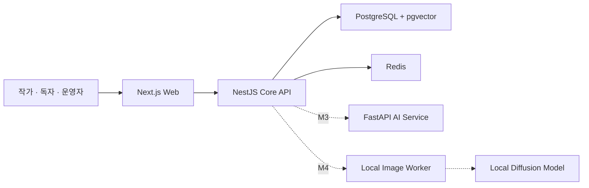

# qqup

> 소설의 원고, 캐릭터 설정과 분기·재합류하는 사건 흐름을 하나의 작업 공간에서 관리하고, 이후 근거 기반 AI 일관성 검사와 로컬 이미지 생성을 연결하는 개인 웹 서비스 프로젝트

이 저장소는 qqup의 공개 포트폴리오다. 실제 제품 소스와 상세 내부 문서는 private 저장소에서 관리하며, 여기에는 공개 가능한 설계 의도, 검증된 진행 상태와 시각 자료만 선별해 기록한다.

| 항목          | 현재 상태                                                      |
| ------------- | -------------------------------------------------------------- |
| 프로젝트 단계 | M1 플랫폼 골격 완료, M2 작가 스튜디오 준비                     |
| 구현된 기반   | Web·Core API·AI Service 골격, DB·Redis, 계약 생성, 테스트와 CI |
| 다음 목표     | 로그인 → 작가 스튜디오 → 비공개 작품 생성·재조회 세로 기능     |
| 제품 소스     | private 저장소에서 별도 관리                                   |
| 외부 데모     | 아직 배포하지 않음                                             |
| 상태 확인일   | 2026-08-20                                                     |

## 해결하려는 문제

장편 소설은 원고만 관리해서는 설정 일관성을 유지하기 어렵다.

- 캐릭터의 외형, 관계와 시간에 따른 상태 변화
- 세계관 규칙, 장소·세력·아이템 설정
- 사건의 실제 발생 순서와 독자에게 서술되는 순서
- 선택에 따라 갈라졌다가 다시 합류하는 사건 흐름
- 과거 회차와 현재 원고 사이의 설정 모순

qqup는 이 정보를 구조화된 데이터와 사건 그래프로 연결한다. 작가는 정확한 날짜가 없는 사건을 상대 순서로, 아직 회차에 배치하지 않은 사건을 미배치 상태로 관리할 수 있다. AI는 원본 설정을 임의로 변경하지 않고 근거가 있는 제안을 제공하며, 최종 결정은 작가가 내리는 방향으로 설계한다.

## 시스템 구성

실선은 현재 구현된 서비스 골격과 데이터 흐름이고, 점선은 후속 마일스톤의 연결 계획이다.



- Web은 Core API만 호출한다.
- Core API가 인증, 작품 접근 권한과 데이터 변경의 최종 판단 주체다.
- AI와 이미지 생성은 원본 데이터와 작가 승인 흐름을 먼저 검증한 뒤 연결한다.
- 모노레포에서 개발하지만 Web·API·AI는 독립 배포 경계를 유지한다.

자세한 책임과 기술 판단은 [상위 아키텍처](docs/architecture.md)에서 설명한다.

## 현재 구현과 계획의 구분

| 상태      | 범위                                                            |
| --------- | --------------------------------------------------------------- |
| 구현 완료 | pnpm workspace 기반 모노레포와 독립 빌드 가능한 세 서비스 골격  |
| 구현 완료 | PostgreSQL·pgvector·Redis 로컬 개발 환경과 healthcheck          |
| 구현 완료 | Prisma 마이그레이션·Client 생성, OpenAPI·Web 계약 생성 흐름     |
| 구현 완료 | 포맷·린트·타입 검사·테스트·빌드·감사와 GitHub Actions           |
| 설계 완료 | 운영 DB 분리, 인증·인가 경계와 공용화 원칙                      |
| 다음 구현 | 세션 인증, 권한 Policy, 작품 CRUD와 작가 스튜디오 첫 화면       |
| 후속 계획 | 에디터·자동 저장, 사건 그래프, 발행·독자 화면, AI와 이미지 생성 |

## AI 보조 개발을 통제하는 방식

Codex를 단순 코드 생성기로만 사용하지 않고, 저장소에 버전 관리되는 작업 계약과 전문 문서를 통해 작업 범위·판단 기준·검증 방식을 통제한다.

```text
private source repository
├── AGENTS.md              # 저장소 공통 작업 계약과 문서 라우팅
├── apps/web/AGENTS.md     # Web 경계·UI·접근성·검증
├── apps/api/AGENTS.md     # API·권한·계약·데이터 변경
└── infra/AGENTS.md        # 로컬 인프라·비밀정보·영속 데이터 안전
```

핵심은 규칙 파일을 많이 만드는 것이 아니라, 공통 규칙과 서비스별 규칙의 책임을 분리하는 것이다. 사용자 제안을 기계적으로 수용하지 않고 현재 마일스톤의 가치, 복잡도, 보안·운영 비용과 가역성을 검토해 대안과 트레이드오프를 함께 제시하도록 구성했다.

설계 배경과 작업 흐름은 [AGENTS.md 계층과 바이브 코딩 운영](docs/vibe-coding-workflow.md)에서 확인할 수 있다. 이 쇼케이스의 `AGENTS.md`는 제품 개발 규칙이 아니라 공개 문서의 사실성과 안전만 관리한다.

## 주요 기술 판단

### AI 프로젝트지만 AI부터 구현하지 않는다

작품·회차·사건의 원본 데이터와 작가 승인 흐름 없이 LLM부터 연결하면 데모는 빠르지만 근거 없는 답변과 설정 오염을 통제하기 어렵다. 먼저 작가 도구와 데이터 모델을 검증한다.

### 사건 그래프 때문에 그래프 DB를 바로 도입하지 않는다

초기에는 PostgreSQL의 사건 노드와 연결선으로 분기와 재합류를 표현한다. 화면 렌더링 라이브러리와 영속 데이터 구조를 분리하고, 실제 질의 복잡도가 확인되기 전에는 별도 그래프 DB를 추가하지 않는다.

### 보안 규칙과 일반 추상화의 시점을 구분한다

인증·인가·작품 소유권처럼 누락이 취약점이 되는 규칙은 첫 사용처부터 공용화한다. 일반 비즈니스 로직은 실제 두 번째 사용처가 확인된 뒤 추출해 사용처 없는 추상화를 피한다.

### 로컬 이미지 생성이 플랫폼 책임을 없애지는 않는다

민감 이미지의 로컬 생성을 우선 검토하더라도 업로드·공개되는 결과에는 플랫폼의 정책과 법적 의무가 남는다. 실행 위치와 서비스 책임을 별개로 설계한다.

## 로드맵

| 마일스톤              | 상태 | 목표                                      |
| --------------------- | ---- | ----------------------------------------- |
| M0 기획과 구현 명세   | 완료 | 사용자 흐름, 데이터 경계와 첫 백로그 확정 |
| M1 플랫폼 골격        | 완료 | Web·API·AI와 로컬 인프라 실행·빌드·검증   |
| M2 작가 스튜디오      | 준비 | 작품·캐릭터·사건·회차 작성과 자동 저장    |
| M3 AI 일관성 검사     | 대기 | 근거가 포함된 모순 검사와 작가 승인       |
| M4 로컬 이미지 생성   | 대기 | 로컬 생성, 선택 업로드와 공개 승인        |
| M5 발행과 독자 검증   | 대기 | 작품 생성부터 회차 발행·열람까지 검증     |
| M6 커뮤니티와 수익화  | 대기 | 상호작용과 작품 단위 유료 구독            |
| M7 국제화와 공개 운영 | 대기 | 한국어 우선 운영과 후속 언어 확장         |

## 화면과 데모

M2의 첫 세로 기능이 실제로 완료된 뒤 테스트 데이터로 만든 스크린샷과 짧은 동작 영상을 추가한다. 아직 구현되지 않은 화면의 목업을 실제 제품 화면처럼 게시하지 않는다.

시각 자료의 공개 기준과 파일 배치는 [시각 자료 안내](assets/README.md)를 따른다.

## 포트폴리오 문서

- [상위 아키텍처](docs/architecture.md)
- [AGENTS.md 계층과 바이브 코딩 운영](docs/vibe-coding-workflow.md)
- [공개 범위와 갱신 기준](docs/portfolio-scope.md)

제품 소스가 private라는 사실은 보안 대책이 아니다. 실제 자격 증명과 사용자 데이터는 private 저장소에도 커밋하지 않으며, 이 저장소에는 공개 검토에 안전한 정보만 유지한다.
