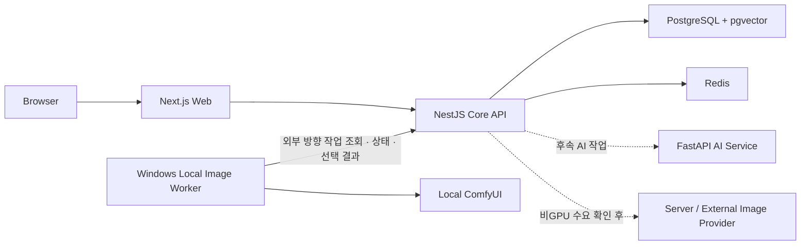

# 상위 아키텍처

> 이 개요의 구현 상태는 2026-09-04 기록을 기준으로 한다. 2026-09-13 확인한 워커 등록·인증·다중 개발 서버 처리와 기본 단일 결과 자동 업로드는 [이미지 워커 연결 흐름](image-worker-connection-lifecycle.md)에서 별도로 설명한다.

## 설계 목표

- 초기 개인 프로젝트에서 운영 복잡도를 통제한다.
- 하나의 모노레포에서 개발하되 Web·Core API·AI Service는 독립 배포할 수 있게 한다.
- 인증, 권한과 원본 데이터 변경의 최종 판단을 Core API에 집중한다.
- AI와 이미지 생성은 후속 기능으로 격리해 핵심 집필·발행 흐름을 먼저 검증한다.
- 이미지 생성은 초기 GPU 서버 운영보다 사용자 장치의 검증된 로컬 실행을 우선하되 비GPU 사용자를 위한 대체 제공자 경계를 닫지 않는다.

## 서비스 경계

| 구성 요소                  | 책임                                                        | 하지 않는 일                                     |
| -------------------------- | ----------------------------------------------------------- | ------------------------------------------------ |
| Web                        | 작가 스튜디오, 독자 화면과 사용자 상호작용                  | DB·AI·이미지 제공자 직접 호출, 최종 권한 판단    |
| Core API                   | 인증·인가, 작품·발행, 공개 계약과 작업 상태·데이터 변경     | 브라우저 UI 렌더링, 모델 추론 직접 수행          |
| AI Service                 | 후속 검색·모순 검사·모델 어댑터                             | 원본 설정 임의 확정, 사용자 권한 최종 판단       |
| Windows Local Image Worker | 사용자 장치에서 작업 조회·사전 검사·이미지 생성·선택 업로드 | 인바운드 서버 역할, 공개 승인과 작품 권한 판단   |
| Local ComfyUI              | Worker가 허용한 로컬 워크플로 실행                          | 인터넷 공개, 작품 데이터와 플랫폼 자격 증명 보관 |
| 대체 이미지 제공자         | 비GPU 사용자를 위한 후속 서버·외부 API 실행 경계            | 제공자 확정 전 구현 완료로 간주                  |
| PostgreSQL                 | 원본 데이터, 관계와 향후 벡터 검색                          | 화면 전용 상태와 모델 실행                       |
| Redis                      | 세션·캐시·속도 제한과 비동기 상태 후보                      | 영구 원본 데이터 보관                            |

## 현재와 후속 범위

M1 플랫폼 골격과 M2 작가 스튜디오는 완료했다. 작품·회차·자동 저장·수정 이력, 캐릭터·세계관, 사건 시간축 DAG와 회차 배치까지 비공개 집필 흐름을 구현했다. M5에서는 현재 원고를 고정 발행본으로 보존하고 재발행·공개 중단하는 기반을 구현했으며, 다음 목표는 고정 발행본만 조회하는 공개 API와 반응형 독자 뷰어다.

M4에서는 캐릭터 FACE 생성 작업과 상태 UI, Windows Worker의 외부 방향 작업 조회, 만료 가능한 실행 할당과 재시도, ComfyUI 실행·로컬 선택·후보 업로드까지 구현했다. Mac↔Windows 실기기 E2E, 이미지 공개 승인과 비GPU 사용자를 위한 대체 제공자는 후속 계획이다. AI Service 골격도 실제 모순 검사 모델 연동 완료를 의미하지 않는다.

## 로컬 우선 하이브리드 이미지 생성

초기에는 플랫폼이 GPU 서버를 직접 운영하지 않고 Windows·NVIDIA 장치의 Local Image Worker를 첫 실행 경로로 사용한다. 이는 아직 수요와 과금이 확인되지 않은 GPU 운영을 앞당기지 않고, 선택 전 생성 결과를 사용자 장치에 유지하기 위한 판단이다.

로컬 전용으로 고정하지는 않는다. 설치·장치 조건을 충족하지 못하는 사용자 수요가 확인되면 Core API의 동일한 권한·작업 상태·사용량·결과 승인 경계 뒤에 서버 또는 외부 API 제공자를 추가한다. 서버가 사용자 PC로 직접 접속하지 않고 Worker가 외부 방향으로 작업을 조회하며, 작가가 로컬에서 선택한 결과만 업로드한다.

로컬 실행은 모델·참고 자료 선택에 관한 사용자 책임 범위를 분명하게 하지만 플랫폼 책임을 없애지 않는다. 업로드·공개되는 결과에는 실행 위치와 무관하게 콘텐츠 등급과 공개 정책을 적용한다.

Worker 실행 본체는 전송 중립 제어면과 생성·선택 어댑터로 분리했다. 현재 HTTP polling을 사용하지만 실제 처리량이 필요성을 증명하면 큐·하이브리드 분배로 바꿀 수 있다. 구현 과정, 복구 경계와 검증 결과는 [Local-first Image Worker 사례 연구](local-first-image-worker.md)에서 설명한다.

## 주요 데이터 판단

사건 흐름은 사건 노드와 방향이 있는 연결선으로 저장한다. 이를 통해 분기뿐 아니라 서로 다른 경로가 다시 합쳐지는 재합류를 표현한다.

- 정확한 날짜가 있는 사건: 시간축 기준 정렬
- 날짜는 없지만 순서가 있는 사건: 상대 순서로 관리
- 아직 회차에 배치하지 않은 사건: 미배치 상태 유지

초기에는 PostgreSQL 관계 모델을 사용한다. 그래프 화면과 저장 모델을 분리하고, 별도 그래프 DB는 실제 질의 복잡도와 규모가 필요성을 증명할 때 검토한다.

## 계약과 데이터베이스

- Core API의 OpenAPI를 공개 계약의 원본으로 두고 Web 타입을 생성한다.
- Prisma 스키마 변경은 새 마이그레이션으로 추적한다.
- 운영 PostgreSQL은 애플리케이션 서버와 분리된 전용 서버 또는 관리형 서비스를 전제로 한다.
- 로컬 Compose의 DB와 Redis는 개발·검증용이며 운영 데이터 저장소로 취급하지 않는다.

## 보안 원칙

- Web 화면의 표시 여부는 사용자 경험일 뿐 최종 권한 검사가 아니다.
- Core API가 현재 사용자, 역할, 작품 소유권과 공개 범위를 검증한다.
- 권한 기본값은 거부이며 클라이언트가 보낸 사용자·역할 정보를 신뢰하지 않는다.
- Local Image Worker는 플랫폼 DB·저장소 자격 증명을 받지 않고 서버가 사용자 PC로 인바운드 접속하지 않는 방향으로 연결한다.
- 로컬 이미지 생성 결과도 서비스에 업로드·공개되는 순간 플랫폼의 검토와 정책 경계를 따른다.

이 문서는 공개 가능한 상위 경계만 설명한다. 상세 운영 절차와 보안 설정은 private 원본에서 관리한다.
