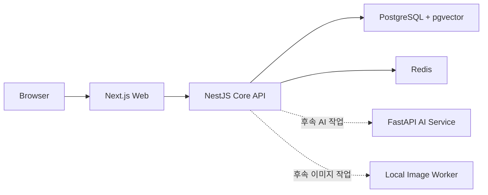

# 상위 아키텍처

## 설계 목표

- 초기 개인 프로젝트에서 운영 복잡도를 통제한다.
- 하나의 모노레포에서 개발하되 Web·Core API·AI Service는 독립 배포할 수 있게 한다.
- 인증, 권한과 원본 데이터 변경의 최종 판단을 Core API에 집중한다.
- AI와 이미지 생성은 후속 기능으로 격리해 핵심 집필·발행 흐름을 먼저 검증한다.

## 서비스 경계

| 구성 요소          | 책임                                               | 하지 않는 일                               |
| ------------------ | -------------------------------------------------- | ------------------------------------------ |
| Web                | 작가 스튜디오, 독자 화면과 사용자 상호작용         | DB·AI 제공업체 직접 호출, 최종 권한 판단   |
| Core API           | 인증·인가, 작품·회차·구독, 공개 계약과 데이터 변경 | 브라우저 UI 렌더링, 모델 추론 직접 수행    |
| AI Service         | 후속 검색·모순 검사·모델 어댑터                    | 원본 설정 임의 확정, 사용자 권한 최종 판단 |
| Local Image Worker | 사용자 장치의 이미지 생성과 결과 반환              | 공개 승인과 작품 접근 권한 결정            |
| PostgreSQL         | 원본 데이터, 관계와 향후 벡터 검색                 | 화면 전용 상태와 모델 실행                 |
| Redis              | 세션·캐시·속도 제한과 비동기 상태 후보             | 영구 원본 데이터 보관                      |

## 현재와 후속 범위

현재 M1에서는 각 서비스의 health 계약, 독립 빌드, DB·Redis 로컬 환경, Prisma와 OpenAPI 생성 흐름, 품질 검사와 CI를 구성했다. 작품 CRUD와 작가 스튜디오는 M2 범위이며 AI 일관성 검사는 M3, 로컬 이미지 생성은 M4 이후에 연결한다.

AI Service 골격이 존재한다고 해서 모델 연동이 완료된 것은 아니다. 서비스 경계를 먼저 검증하고 제품 원본 데이터가 안정된 뒤 기능을 추가하는 순서다.

## 주요 데이터 판단

사건 흐름은 사건 노드와 방향이 있는 연결선으로 저장한다. 이를 통해 분기뿐 아니라 서로 다른 경로가 다시 합쳐지는 재합류를 표현한다.

- 정확한 날짜가 있는 사건: 시간축 기준 정렬
- 날짜는 없지만 순서가 있는 사건: 상대 순서로 관리
- 아직 회차에 배치하지 않은 사건: 미배치 상태 유지

초기에는 PostgreSQL 관계 모델을 사용한다. 그래프 화면과 저장 모델을 분리하고, 별도 그래프 DB는 실제 질의 복잡도와 규모가 필요성을 증명할 때 검토한다.

## 계약과 데이터베이스

- Core API의 OpenAPI를 공개 계약의 원본으로 두고 Web 타입을 생성한다.
- Prisma 스키마 변경은 새 마이그레이션으로 추적한다.
- 운영 PostgreSQL은 애플리케이션 서버와 분리된 전용 서버 또는 관리형 서비스를 전제로 한다.
- 로컬 Compose의 DB와 Redis는 개발·검증용이며 운영 데이터 저장소로 취급하지 않는다.

## 보안 원칙

- Web 화면의 표시 여부는 사용자 경험일 뿐 최종 권한 검사가 아니다.
- Core API가 현재 사용자, 역할, 작품 소유권과 공개 범위를 검증한다.
- 권한 기본값은 거부이며 클라이언트가 보낸 사용자·역할 정보를 신뢰하지 않는다.
- 로컬 이미지 생성 결과도 서비스에 업로드·공개되는 순간 플랫폼의 검토와 정책 경계를 따른다.

이 문서는 공개 가능한 상위 경계만 설명한다. 상세 운영 절차와 보안 설정은 private 원본에서 관리한다.
