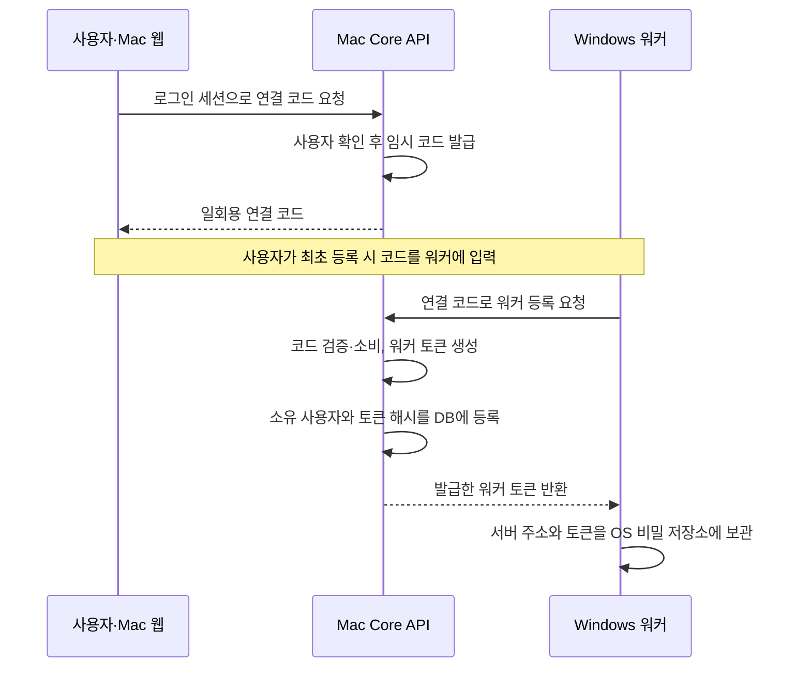
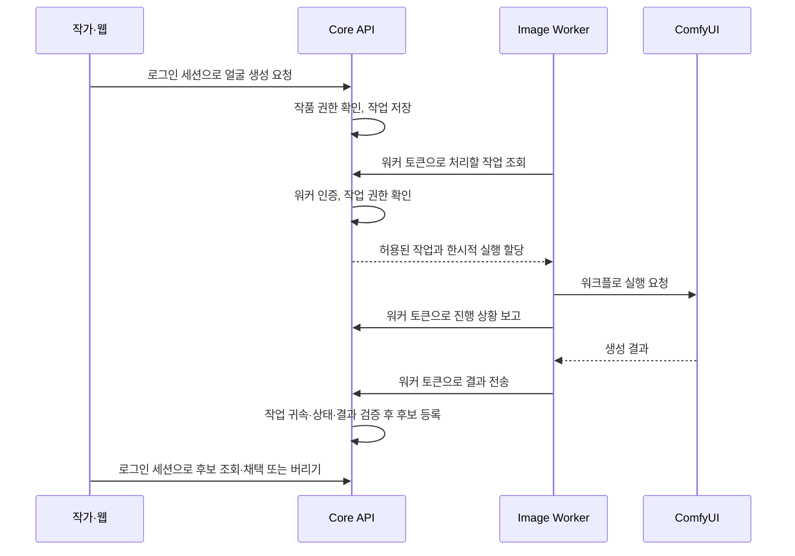

# 이미지 워커 연결: 최초 등록부터 요청별 인증까지

> 확인일: 2026-09-13 · 상태: 연결·인증·다중 개발 서버 처리 코드와 관련 테스트 확인
>
> 이 문서는 구현된 흐름을 공개 가능한 수준으로 설명한다. 운영 배포 완료나 이번 문서 작업에서 실제 이미지 생성을 재검증했다는 의미는 아니다.

**Core API가 워커의 출입증을 발급하고, Windows 워커가 보관하며, Core API가 요청을 받을 때마다 검사하는 구조다.**

예시는 Mac에서 Web·Core API를 실행하고, Windows GPU 장치에서 Image Worker·ComfyUI로 **얼굴 정지 이미지**를 생성하는 개발 환경이다. 운영자는 워커를 최초 한 번 등록하고, 이후 작가는 웹에서 이미지 생성만 요청한다. 매 이미지 요청마다 연결 코드를 입력하지 않는다.

## 1. 왜 연결 등록과 이미지 생성을 분리했나

브라우저가 GPU 장치에 직접 접속하도록 만들면 작가 화면이 장치 주소, 인증 정보와 재연결까지 알아야 한다. 생성 장비가 바뀔 때마다 사용자 흐름도 영향을 받는다.

역할을 다음처럼 나누었다.

| 구성 요소    | 담당하는 일                                      | 맡기지 않은 일                    |
| ------------ | ------------------------------------------------ | --------------------------------- |
| Web          | 로그인한 작가의 생성 요청과 결과 확인            | 워커 토큰 보관, ComfyUI 직접 호출 |
| Core API     | 워커 등록·인증, 작품 권한, 작업 배정과 결과 관리 | GPU 모델 실행                     |
| Image Worker | 허용된 작업 조회, 생성 실행, 진행 상황·결과 전송 | 사용자·작품 권한의 최종 판단      |
| ComfyUI      | 워커가 전달한 워크플로로 이미지 생성             | 플랫폼 워커 토큰 발급·검사        |

여기서 **등록**은 앞으로 작업을 맡겨도 되는 워커인지 승인하는 일이고, **인증**은 지금 요청한 주체가 그 등록된 워커인지 확인하는 일이다. 인증이 성공해도 모든 사용자의 작업을 처리할 권한이 생기는 것은 아니다.

## 2. 비슷해 보이는 세 가지 인증 정보

| 구분               | 누가 사용하는가                  | 언제 사용하는가                                   |
| ------------------ | -------------------------------- | ------------------------------------------------- |
| 사용자 로그인 세션 | 웹 브라우저                      | 연결 등록을 승인하거나 작품의 이미지를 요청할 때  |
| 일회용 연결 코드   | 최초 등록을 진행하는 운영자·워커 | 사용자 승인과 워커 등록을 연결할 때만             |
| 워커 토큰          | Image Worker                     | 등록 후 작업 조회·상태 보고·결과 전송을 할 때마다 |

연결 코드는 짧은 시간만 유효한 **등록용 교환권**, 워커 토큰은 이후 요청에 사용하는 **출입증**에 가깝다. 웹 로그인 비밀번호나 외부 AI 제공자의 API 키를 워커 토큰으로 사용하지 않는다.

## 3. 이벤트 예시 A: Mac API에 Windows 워커를 처음 등록

아래는 일회용 코드를 사용하는 최초 등록 예시다. 승인된 개발용 장치 발견 흐름도 있지만, 여기서는 발급과 저장의 책임을 이해하기 쉬운 코드 교환 경로를 설명한다.

실제 토큰은 **Mac의 Core API가 암호학적으로 안전한 난수로 생성**한다. Windows 워커나 ComfyUI가 임의로 만든 값을 서버에 등록하는 방식이 아니다.

저장 위치도 서로 다르다.

| 위치                     | 저장하는 정보                                            | 이유                                       |
| ------------------------ | -------------------------------------------------------- | ------------------------------------------ |
| Core API의 임시 저장소   | 연결 코드에 연결된 사용자와 유효기간                     | 최초 승인을 제한된 시간에 한 번만 사용     |
| Core API의 DB            | 워커 식별 정보·소유 사용자·권한 범위·토큰 해시·폐기 여부 | 원문 토큰을 저장하지 않고 요청을 검증      |
| Windows 자격 증명 관리자 | 해당 서버 주소와 원문 워커 토큰을 담은 연결 프로필       | 재실행할 때 인증 정보를 다시 입력하지 않음 |

해시는 토큰의 검사용 지문이다. API는 받은 토큰으로 같은 지문을 계산해 등록 정보와 비교한다. 코드 교환 방식에서는 원문 토큰이 API에서 워커로 전달되고, 웹은 워커 토큰을 보관할 필요가 없다.

서버 DB 등록과 Windows 저장은 프로그램이 수행한다. 운영자가 토큰을 DB에 직접 입력하거나 저장소에 커밋하지 않는다. Git으로 프로젝트를 내려받는 것만으로 다른 장치에 인증 정보가 복제되지도 않는다.

## 4. 이벤트 예시 B: 다음 날 실행하고 얼굴 생성을 요청

다음 날 서버와 워커를 다시 실행하면 워커는 저장된 프로필을 읽는다. 정상적인 재시작 때문에 새로운 연결 코드나 토큰을 발급하지 않는다.

워커는 먼저 준비 상태를 보고한다. 이 요청에도 토큰을 첨부하며, API는 등록 정보·폐기 여부·권한 범위가 유효한지 확인한다. 이후 작가가 얼굴 생성을 요청하면 다음 순서로 진행한다.

**인증은 워커 시작 시 한 번으로 끝나지 않는다.** 등록이 끝난 뒤 사용하는 준비 상태 보고, 작업 조회, 진행 보고와 결과 업로드 등 작업·상태 API 요청마다 공통 인증 계층을 통과한다. 최초 코드 교환은 앞서 설명한 별도의 승인 경계다.

그 뒤에는 별도의 작업 권한 검사가 이어진다.

- 사용자 전용 워커는 해당 서버에서 소유 사용자의 허용된 작업만 받는다.
- 작업에는 한시적 실행 할당인 **lease**가 있어 오래된 실행의 보고가 새 실행을 덮어쓰지 못하게 한다.
- 결과 전송에서도 해당 워커의 작업인지와 처리 가능한 상태인지 등을 확인한다. 유효한 워커 토큰만으로 임의의 작업을 완료할 수 없다.

현재 얼굴 정지 이미지의 기본 단일 결과 경로는 생성 결과를 자동 업로드해 비공개 후보로 등록한다. 작가는 웹에서 후보를 채택하거나 버릴 수 있다. **자동 업로드와 작가의 최종 채택은 다른 단계**이며, 독자에게 공개된다는 의미도 아니다. 초기 로컬 수동 선택 방식과 현재 기본 흐름을 혼동하지 않도록 구분한다. 모션 등 다른 자산의 승인 상태까지 이 예시와 같다고 가정하지 않는다.

## 5. 이벤트 예시 C: Windows API도 같은 GPU 워커에 연결

Mac과 Windows에서 각각 독립된 Core API·DB를 실행한다면, 각 서버에 별도로 등록한다. 아래 A·B는 실제 토큰이 아닌 설명용 표기다.

| 워커가 접속하는 대상    | 발급 주체        | 워커가 사용하는 연결 정보        |
| ----------------------- | ---------------- | -------------------------------- |
| Mac의 개발 Core API     | Mac Core API     | Mac용 프로필에 저장한 토큰 A     |
| Windows의 개발 Core API | Windows Core API | Windows용 프로필에 저장한 토큰 B |

워커 하나가 선택된 두 프로필을 읽고 서버를 번갈아 확인한다. Mac에서 받은 작업의 결과는 Mac API로, Windows에서 받은 작업의 결과는 Windows API로 돌려준다. 로컬 결과도 서버별로 구분해 잘못된 서버에 업로드하지 않도록 한다.

연결 목록에 기존 프로필을 추가하는 것은 **이미 등록된 서버를 함께 사용할지 선택하는 일**이다. 새 토큰을 발급하거나 권한을 높이는 동작이 아니다. 실행 중인 워커에 목록 변경을 적용하려면 재시작한다.

이 구조에서 함께 사용하는 것은 GPU 실행 자원이다.

- 연결이 두 개라고 워커용 ComfyUI나 모델 파일을 두 벌 실행·복제하지 않는다.
- 같은 워커는 한 작업의 생성·전송을 처리한 뒤 다음 서버에 차례를 넘긴다.
- 두 서버의 작품·캐릭터 DB가 자동으로 동기화되지는 않는다.
- 한 서버가 꺼지면 해당 연결을 재시도하며 다른 서버의 처리는 계속할 수 있다. 다만 순차 처리이므로 응답 없는 서버의 요청 대기 시간이 다음 서버 확인을 늦출 수 있다.

## 6. 자주 헷갈리는 상황

| 상황                                       | 일어나는 일                                | 구분할 점                                       |
| ------------------------------------------ | ------------------------------------------ | ----------------------------------------------- |
| 워커나 Core API를 재시작                   | 저장 정보가 유지되면 기존 토큰을 다시 사용 | 재시작은 재등록이 아님                          |
| 최초 연결 코드가 만료되거나 이미 사용됨    | 해당 코드로 등록할 수 없어 새 코드가 필요  | 이미 발급된 워커 토큰의 상태와는 별개           |
| API·네트워크가 일시적으로 끊김             | 실패한 연결을 재시도                       | 오프라인만으로 토큰을 새로 발급하지 않음        |
| 독립된 다른 서버에 잘못된 토큰을 보냄      | 그 서버에 대응하는 등록이 없어 인증 거부   | 서버별 주소와 토큰을 한 쌍으로 관리             |
| 웹의 운영 설정에서 워커 등록을 폐기        | 이후 워커 요청의 인증을 거부               | GPU 장치의 프로그램을 원격 종료하는 기능은 아님 |
| Windows의 저장된 프로필만 지움             | 그 장치에서 기존 연결을 불러올 수 없음     | 서버 측 토큰 폐기와는 별개                      |
| 연결 정보는 있지만 ComfyUI가 준비되지 않음 | 등록되어 있어도 생성 준비 상태는 아님      | 저장됨·접속 가능·생성 준비를 각각 판단          |

토큰 인증은 운영체제나 물리 PC를 직접 증명하는 방식이 아니다. **비밀 토큰을 가진 요청 주체를 등록된 워커로 인정하는 방식**이므로 토큰 원문은 비밀번호처럼 보호해야 한다.

VPN 같은 네트워크 연결은 서버에 도달할 통로를 제공할 뿐이다. 워커 등록과 API 인증을 대신하지 않고, 꺼진 Core API나 ComfyUI를 실행해 주지도 않는다.

## 7. 설계 판단과 배포 경계

- **한 번의 등록과 반복 실행을 분리했다.** 작가의 매 생성 요청에 장치 연결 절차가 끼어들지 않지만, 최초 등록과 폐기는 별도 운영 책임으로 남는다.
- **워커가 작업을 가져오게 했다.** Core API가 GPU 장치에 새 연결을 열 필요가 없다. 대신 polling 간격과 네트워크 상태에 따른 대기 비용이 있다.
- **Core API가 권한과 작업 상태를 유지한다.** 워커를 전용 서버로 옮겨도 웹은 같은 역할의 API에 요청할 수 있다. 다만 실행 환경 설치와 비밀정보 공급까지 자동으로 해결되는 것은 아니다.
- **개발용 다중 연결과 운영용 작업 분배를 구분했다.** 두 개발 서버를 한 GPU에 연결한 것은 대규모 다중 사용자 스케줄러나 고가용성 구성을 구현했다는 의미가 아니다.

현재 Windows 개발 환경은 OS 자격 증명 저장소를 사용한다. 헤드리스 서버에는 별도의 비밀정보 주입 경로가 있다. Windows의 다중 프로필 관리가 모든 서버 운영체제에서 동일하게 제공된다고 가정하지 않는다.

## 8. 확인한 범위와 아직 주장하지 않는 것

2026-09-13 기준으로 원본 구현과 관련 테스트를 대조한 범위는 다음과 같다.

- 최초 등록 코드의 일회성, API의 토큰 발급과 해시 저장
- 워커 요청별 인증, 사용자 전용 권한과 작업 할당 검사
- Windows 연결 저장·재사용, 서버 측 폐기와 로컬 저장 삭제의 구분
- 다중 서버 연결 선택, 교대 처리·재시도와 결과 귀속 분리
- 얼굴 정지 이미지의 기본 단일 결과 자동 업로드와 작가의 후보 채택 분리

이번 변경은 문서화 작업이다. 제품 테스트 전체나 실제 두 장치의 이미지 생성 E2E를 새로 실행한 결과는 포함하지 않는다. 클라우드 GPU 운영, 대규모 동시 처리, 자동 토큰 회전이나 모든 모델의 호환성도 이 문서로 완료를 주장하지 않는다.

## 이어서 읽기

- [Local-first Image Worker 초기 사례 연구](local-first-image-worker.md): 실행 위치 분리, lease·멱등성·복구를 처음 도입한 배경
- [상위 아키텍처](architecture.md): Web·Core API·생성 실행의 책임 경계
- [공개 범위와 갱신 기준](portfolio-scope.md): 구현 근거와 운영 정보의 공개 경계
