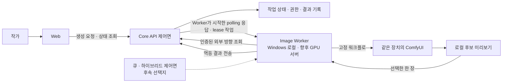
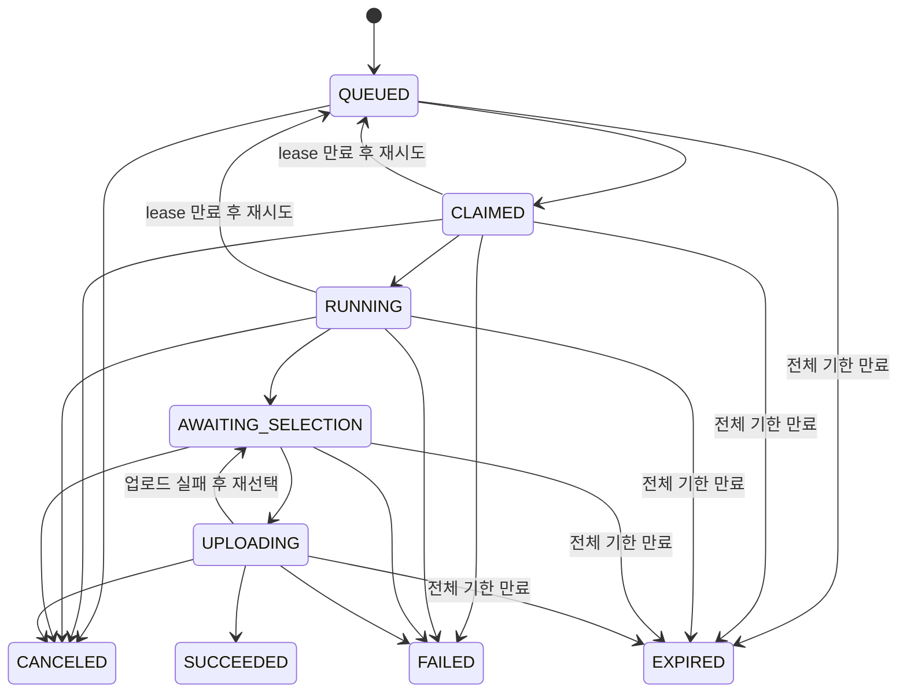
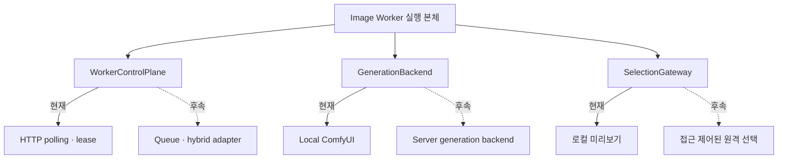

# Local-first Image Worker 사례 연구

> 확인일: 2026-09-04 · 상태: FACE 생성 핵심 흐름 구현, 실제 2기기 E2E는 후속 검증

이 문서는 초기 구현 당시의 설계·검증 기록을 보존한다. 이후 추가된 최초 등록·요청별 인증·다중 개발 서버 연결과 현재 기본 단일 결과 자동 업로드는 [이미지 워커 연결 흐름](image-worker-connection-lifecycle.md)에서 설명한다. 아래의 로컬 수동 선택 절차를 현재 기본 사용 절차로 해석하지 않는다.

## 해결하려던 문제

이미지 생성 모델은 일반 Web 요청보다 실행 시간이 길고 GPU 자원을 많이 사용한다. 초기 개인 프로젝트가 수요를 확인하기 전에 전용 GPU 서버부터 운영하면 장치 비용뿐 아니라 작업 분배, 동시 실행 제한, 모델 배포와 장애 복구까지 한꺼번에 떠안게 된다.

반대로 Web이 Windows 노트북의 ComfyUI를 직접 호출하면 사용자 장치에 인바운드 포트를 열어야 하고, 브라우저에 Worker 주소·인증·재시도 책임이 노출된다. 나중에 GPU 서버나 외부 제공자로 옮길 때 UI 계약도 다시 만들어야 한다.

초기 목표는 다음 세 가지였다.

- 검증된 Windows·NVIDIA GPU를 첫 생성 경로로 사용해 초기 운영 비용을 통제한다.
- Web과 GPU 실행 위치 사이에 Core API 제어면을 두어 권한과 작업 상태를 한곳에서 판단한다.
- 현재 HTTP polling을 사용하더라도 향후 큐·하이브리드 분배로 옮길 수 있는 경계를 먼저 만든다.

## 전체 구조

Web은 Worker나 ComfyUI의 위치를 알지 못하고 Core API만 호출한다. Worker가 서버를 주기적으로 조회하므로 서버가 방화벽이나 NAT 안의 사용자 PC에 직접 접속하지 않는다. ComfyUI는 Worker와 같은 장치에 머물고 외부 서비스 역할을 하지 않는다.

## Core API를 중간에 둔 이유

Core API는 단순한 중계기가 아니라 이미지 작업의 최종 판단 주체다.

- 현재 사용자와 작품 접근 권한 확인
- 중복 생성 방지와 작업 상태 전이 관리
- 실행 중 Worker가 유효한지 확인하는 lease와 오래된 실행 차단
- 네트워크 중단 후 재시도해도 같은 결과가 중복 등록되지 않는 멱등 처리
- 선택 결과의 파일 정책 확인과 비공개 후보 등록

이 경계 덕분에 Worker의 실행 위치가 사용자 노트북에서 전용 GPU 서버로 바뀌어도 Web의 요청 흐름과 작품 권한 모델은 유지할 수 있다.

## 긴 작업을 안전하게 다루는 방법

이미지 생성 도중 Worker나 네트워크가 끊길 수 있으므로 단발성 HTTP 응답만 기다리지 않는다. 작업은 제한된 실행 권한인 lease를 사용하고, 만료된 실행의 늦은 상태 보고는 새 실행을 덮어쓰지 못한다. 선택 또는 업로드 중 Worker가 재시작되면 서버의 미완료 상태와 로컬 메타데이터를 맞춰 같은 결과를 복구한다.

현재 polling 구현은 작업이 없을 때 호출 시점에 작은 무작위 편차를 주고, 연속 오류에는 상한이 있는 지수 backoff를 적용한다. 여러 Worker가 동시에 서버를 반복 호출하거나 장애를 증폭시키는 상황을 줄이기 위한 운영 안전장치다.

## 선택한 결과만 업로드

생성 후보 전체를 서버에 자동 전송하지 않는다. 먼저 Windows 장치에서 후보를 확인하고, 작가가 고른 한 장만 Core API로 보내 기존 캐릭터의 비공개 후보 이미지로 등록한다. 최종 승인은 별도 작가 동작으로 남긴다.

이 선택은 초기 단계에서 다음 비용과 위험을 줄인다.

- 선택하지 않은 생성물의 저장·전송 비용
- 민감할 수 있는 중간 결과의 불필요한 서버 보관
- 임시 후보 전체에 필요한 접근 제어와 자동 삭제 운영

향후 다른 기기에서 후보를 골라야 한다면 비공개 임시 저장소, 만료 정책과 콘텐츠 검토를 먼저 설계해야 한다.

## 큐로 옮길 수 있는 Worker 경계

Worker 실행 본체는 구체적인 HTTP client가 아니라 `WorkerControlPlane` 계약에 의존한다. 현재 어댑터는 Core API를 polling하지만, 처리량이 실제로 증가하면 큐 또는 HTTP·큐 하이브리드 어댑터로 교체할 수 있다. 생성 실행과 결과 선택도 별도 경계로 나눠 배포 위치의 차이가 작업 상태 로직에 퍼지지 않게 했다.

큐와 전용 GPU 서버는 아직 구현 완료가 아니다. 먼저 단일 사용자·단일 Worker 흐름을 검증하고, 측정된 대기 시간과 동시 실행 수가 필요성을 증명할 때 도입한다.

## 검증 결과

| 검증 항목        | 확인 결과                                                                                               |
| ---------------- | ------------------------------------------------------------------------------------------------------- |
| 실제 GPU 생성    | Windows 11, RTX 4070 Laptop GPU, ComfyUI 0.34.0에서 고정 SD 1.5 워크플로로 512×512 PNG 생성 성공        |
| 사전 검사        | GPU·VRAM, ComfyUI 버전, 필수 노드와 허용 모델을 생성 전에 확인                                          |
| 실제 생성 측정   | 단일 실행에서 Worker 약 6.2초, ComfyUI 약 5.9초, 최대 관찰 VRAM 약 3.18GiB                              |
| Worker 통합 검증 | 가짜 Core API와 실제 ComfyUI를 연결해 작업 수신, 실행 상태, lease, 로컬 선택과 multipart 결과 전송 확인 |
| 자동 검증        | Worker Ruff·Pyright 통과, pytest 43개 통과                                                              |

측정값은 한 종류의 장치에서 수행한 단일 기술 검증이며 일반적인 성능 기준이나 최소 GPU 요구사항을 의미하지 않는다. 모델 체크섬, 실제 프롬프트, 토큰, 내부 주소와 원문 로그는 공개 대상에서 제외했다.

## 얻은 결과와 남은 범위

이번 구현으로 브라우저가 GPU 장치를 직접 호출하지 않으면서도 캐릭터 FACE 생성 요청부터 로컬 선택, 비공개 후보 등록까지 연결할 기반을 만들었다. 로컬 우선 전략을 최종 제약으로 고정하지 않고 Core API 제어면과 Worker 어댑터를 분리해 이후 배포 선택을 늦출 수 있게 한 것이 핵심이다.

아직 완료로 주장하지 않는 범위는 다음과 같다.

- Mac의 Web·Core API와 Windows Worker를 연결한 실제 2기기 E2E
- 더 낮은 VRAM과 다른 GPU·운영체제의 호환성
- 생성 이미지 콘텐츠 등급과 독자 공개 승인 정책
- 전용 GPU 서버, 외부 이미지 제공자와 실제 큐 분배
- 승인된 얼굴을 입력으로 사용하는 여러 각도 얼굴 일관성 워크플로

이 후속 검증은 사용자 수요, 운영 비용과 공개 정책을 확인한 뒤 같은 Core API 작업 경계 위에서 확장한다.
