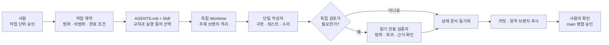

# 개인 개발자를 위한 최소 AI 개발 루프

## 배경

AI와 대화하며 기능을 빠르게 만드는 것만으로는 장기 프로젝트를 안정적으로 운영하기 어렵다. 세션이 바뀔 때마다 범위와 완료 기준을 다시 설명하게 되고, 코드가 바뀌어도 테스트·진행 문서·Git 전달 상태가 함께 갱신되지 않을 수 있기 때문이다.

qqup에서는 이 문제를 줄이기 위해 사용자가 승인한 작업 단위 하나를 구현, 검증, 문서 동기화와 원격 작업 브랜치 전달까지 반복하는 `Qqup Feature Loop`를 구성했다. 목표는 완전 자율 개발이 아니라, 반복 가능한 절차는 AI에 맡기고 제품 결정과 `main` 병합 권한은 사람이 유지하는 것이다.

이 문서에서 Loop Engineering은 특정 제품이나 하나의 표준 구성을 뜻하지 않는다. 목표와 검증 기준을 먼저 고정하고 AI가 구현, 평가와 수리를 반복하도록 운영하는 접근을 가리킨다. [Addy Osmani의 Loop Engineering 글](https://addyosmani.com/blog/loop-engineering/)에서 제시한 루프 관점을 참고하되, qqup의 규모와 개발 방식에 맞춰 최소 구성으로 적용했다.

## 왜 최소 루프인가

여기서 “완전한 루프”는 자동 일정 실행, 여러 병렬 에이전트, 외부 커넥터, 장기 상태와 기억, 자동 배포까지 상시 연결한 구성을 뜻한다. 이런 구성은 복잡하거나 독립적으로 나눌 수 있는 업무에서는 가치가 있지만, 개인 프로젝트의 작은 기능 단위에는 조정 비용이 구현 이익보다 커질 수 있다.

[OpenAI의 Subagents 문서](https://learn.chatgpt.com/docs/agent-configuration/subagents)도 각 서브에이전트가 별도의 모델·도구 작업을 수행하므로 유사한 단일 에이전트 실행보다 더 많은 토큰을 사용한다고 설명한다. 따라서 qqup에서는 구성 요소의 수보다 다음 원칙을 우선했다.

- 하나의 작업 단위에는 한 명의 주 작성자만 둔다.
- 독립 검증은 사소하지 않은 변경에만 읽기 전용 에이전트 한 명을 사용한다.
- 자동 일정, 외부 커넥터와 배포는 실제 반복 수요가 확인되기 전까지 연결하지 않는다.
- 장기 Goal은 긴 작업에서 사용자가 명시적으로 요청할 때만 사용한다.
- 루프는 커밋과 원격 작업 브랜치 푸시에서 멈추고 `main` 병합은 사람이 승인한다.

이 선택이 토큰이나 시간을 특정 비율만큼 절감했다고 주장하지는 않는다. 아직 비교 측정값이 없기 때문이다. 대신 불필요한 모델 호출과 조정 단계를 기본 경로에서 제외한 비용 절감 설계로 기록하고, 이후 같은 크기의 작업을 반복할 때 실제 소요 시간과 재작업 횟수로 검증한다.

## 구성



| 구성 요소                  | 적용 방식               | 선택 이유                                                      |
| -------------------------- | ----------------------- | -------------------------------------------------------------- |
| `AGENTS.md` 계층           | 항상 적용               | 저장소 공통 규칙과 서비스별 경계를 코드와 함께 버전 관리       |
| 프로젝트 Skill             | 루프 개발 요청에만 적용 | 반복 절차를 매번 긴 프롬프트로 다시 설명하지 않음              |
| Git worktree               | 작업 단위별 적용        | 다른 작업과 사용자 변경을 섞지 않고 독립적으로 검증            |
| Markdown·Git 상태          | 항상 적용               | 대화 기억이 아닌 검토 가능한 파일과 이력을 기준으로 인계       |
| 서브에이전트               | 조건부 1명              | 사소하지 않은 최종 diff를 독립적으로 확인하되 병렬 작성은 금지 |
| Goal·장기 실행             | 명시 요청 시에만 적용   | 짧은 작업에 불필요한 지속 상태와 운영 비용을 만들지 않음       |
| 자동 일정·외부 커넥터·배포 | 현재 제외               | 반복 수요와 권한 모델이 확인된 뒤 별도 자동화로 설계           |

프로젝트 Skill은 반복 가능한 작업 절차를 저장소에 두는 방식이며 [OpenAI의 Skills 문서](https://learn.chatgpt.com/docs/build-skills)를 참고했다. 독립 작업 디렉터리는 [OpenAI의 Git worktrees 문서](https://learn.chatgpt.com/docs/environments/git-worktrees)의 격리 방식을 활용한다.

## 사용법

`Qqup Feature Loop` Skill이 포함된 private 소스 브랜치를 Codex 작업 공간으로 연 뒤, 한 번에 검증 가능한 기능 하나를 지정한다. 자연어로 요청하거나 Skill 이름을 명시할 수 있다.

```text
다음 목표인 회차 자동 저장·복원을 Qqup Feature Loop로 개발해.
완료 후 원격 작업 브랜치까지만 푸시하고 main 병합은 내가 확인할게.
```

```text
$qqup-feature-loop 회차 자동 저장·복원을 구현해.
```

루프가 시작되면 다음 순서로 진행된다.

1. 목표, 포함 범위, 비범위, 완료 조건과 수집할 증거를 짧은 작업 계약으로 제시한다.
2. 최신 `main`에서 독립 worktree와 주제 브랜치를 준비한다.
3. 가장 작은 완결 기능을 구현하고 관련 테스트와 실제 사용자 흐름을 검증한다.
4. 필요한 경우 읽기 전용 검증자가 최종 변경을 독립 검토하고, 발견 사항을 수정한 뒤 재검증한다.
5. 실제 상태가 달라졌을 때만 관련 문서를 갱신한다.
6. 관련 파일만 커밋하고 원격 주제 브랜치에 푸시한 뒤 결과와 남은 위험을 보고한다.
7. 사용자가 동작과 변경 범위를 확인한 뒤 `병합해줘`라고 요청하면 별도 단계로 `main` 병합을 진행한다.

설명, 진단, 기획만 필요한 요청이나 한 줄짜리 단순 수정에는 이 루프를 사용하지 않는다. 그런 작업까지 같은 절차로 감싸면 검증 이익보다 준비·보고 비용이 커질 수 있다.

## 어디까지 자동화했는가

| 자동 처리                       | 사람에게 남긴 결정               |
| ------------------------------- | -------------------------------- |
| 저장소 규칙과 관련 문서 탐색    | 구현할 제품 목표와 우선순위 승인 |
| 작업 브랜치·worktree 격리       | 범위를 바꾸는 새 제품 결정       |
| 구현, 관련 검사, 실패 원인 수리 | 필수 검증을 생략할지 여부        |
| 영향받은 상태 문서 갱신         | 공개 포트폴리오 반영 여부        |
| 커밋과 원격 작업 브랜치 푸시    | PR, `main` 병합과 배포           |

이 경계는 AI가 모든 결정을 대신하는 구조가 아니다. 반복 작업은 자동화하되, 되돌리기 어렵거나 공개 상태를 바꾸는 결정은 사람이 증거를 보고 승인하는 구조다.

## 더 큰 루프가 적합한 경우

완전한 구성이 항상 나쁜 것은 아니다. 입력, 출력과 성공 기준이 명확하고 같은 절차가 자주 반복되면 초기 구성 비용을 회수하기 쉽다.

- 매일 들어오는 이슈의 분류와 중복 탐지
- 정기적인 문서 불일치 검사와 변경 제안
- CI 실패 로그 수집, 원인 분류와 담당 영역 연결
- 릴리스 노트와 주간 진행 보고 초안 생성
- 서로 독립적인 대규모 코드 탐색이나 보안·회귀 검토

즉, 개인 개발의 작은 기능 구현에는 최소 루프가 알맞고, 반복 빈도가 높은 일상 업무에는 자동 일정·커넥터·여러 전문 에이전트를 단계적으로 추가할 여지가 있다.

## 평가 계획

루프의 효율은 인상보다 비교 가능한 기록으로 판단한다.

| 관찰 항목                                 | 확인하려는 질문                             |
| ----------------------------------------- | ------------------------------------------- |
| 작업 시작부터 원격 브랜치 전달까지의 시간 | 준비 절차가 전체 리드타임을 실제로 줄였는가 |
| 실패한 검사와 재실행 횟수                 | 오류 수리 루프가 회귀를 조기에 발견했는가   |
| 누락된 문서·계약 수정 횟수                | 코드 외 상태가 함께 유지됐는가              |
| 사용자의 범위 교정 횟수                   | 작업 계약이 의도 이탈을 줄였는가            |
| 작업 크기 대비 모델 호출과 토큰           | 조건부 검증 전략이 비용을 통제했는가        |

현재 v1은 private 개발 브랜치에서 Skill 구조, 작업 계약, 격리 작업, 검증 체크리스트와 사람의 병합 게이트까지 구성하고 정적 검증을 완료했다(확인일: 2026-08-25). 실제 기능 작업을 몇 차례 수행한 뒤 위 지표로 절차를 줄이거나 확장한다.
