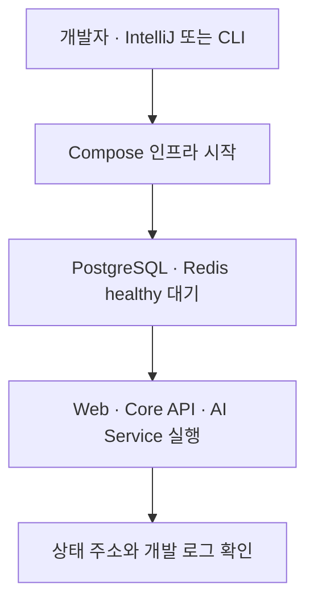

# 재현 가능한 로컬 개발환경과 IDE 협업

## 문제

로컬에서 Web, API, AI Service와 PostgreSQL·Redis를 함께 사용하는 프로젝트는 실행 순서와 도구 버전이 조금만 달라도 “한 사람의 PC에서만 실행되는 환경”이 되기 쉽다. IDE의 개인 Run 설정에만 의존하면 새 팀원이 같은 메뉴를 직접 다시 만들고, 설정이 어긋나도 Git 리뷰와 CI에서 발견하기 어렵다.

qqup에서는 CLI 명령, 버전 기준, 로컬 인프라와 IDE 실행 설정의 책임을 분리해 개발환경도 코드처럼 재현 가능한 대상으로 관리한다.

## 설계 원칙

### CLI 스크립트가 실행 명령의 원본이다

개발·검사·인프라 명령은 루트 `package.json` 스크립트에서 관리한다. IntelliJ IDEA를 쓰지 않는 개발자와 CI도 같은 명령을 실행할 수 있다.

```text
package scripts
├── infra:up / infra:down
├── dev / dev:web / dev:api / dev:ai
└── check
```

IDE Run 설정은 이 명령을 호출하는 얇은 어댑터다. 실제 동작을 IDE XML에 다시 작성하지 않으므로 CLI와 IDE 사이에 두 개의 실행 원본이 생기지 않는다.

### 프로젝트 상대 경로만 공유한다

Run 설정은 프로젝트 루트와 사용자 홈 같은 IDE 매크로, 프로젝트 런타임을 사용한다. 개인 사용자명, 로컬 절대 경로, 특정 패키지 관리자 설치 위치와 환경 변수 값을 저장하지 않는다. 셸 초기화 파일을 읽지 않는 GUI 실행 환경에서도 사용자 도구를 찾을 수 있도록 필요한 경로는 사용자 홈 매크로로 표현하고 기존 `PATH`를 보존한다.

개발자별 UI 상태는 Git에서 제외하고, 팀 공용 Run 설정만 별도 프로젝트 파일로 관리한다. 저장소를 어느 디렉터리에 복제하더라도 같은 설정을 사용할 수 있게 하기 위한 선택이다.

### 인프라 준비 순서를 실행 흐름에 포함한다

전체 개발 서버를 실행하기 전에 Docker Compose가 PostgreSQL·Redis를 시작하고 healthcheck가 통과할 때까지 기다린다.



단순 Compound 실행은 인프라와 애플리케이션을 동시에 시작할 수 있다. qqup는 종료되는 선행 작업으로 인프라 준비를 연결해 애플리케이션의 초기 연결 실패 가능성을 줄였다.

## 공유 Run 설정의 범위

| 설정           | 책임                                        |
| -------------- | ------------------------------------------- |
| Infra Up       | 개발용 PostgreSQL·Redis 실행과 healthy 대기 |
| Dev All        | 세 애플리케이션 서비스 동시 실행            |
| Web / API / AI | 한 서비스만 독립 실행                       |
| Check          | 포맷·린트·타입·테스트·빌드·의존성 검사      |
| Infra Down     | 영속 볼륨을 보존하며 로컬 인프라 중지       |

Docker Desktop 자체 실행, 도구 설치와 실제 환경 변수 생성은 Run 설정에 숨기지 않는다. 운영체제와 개발자별 책임을 자동화한 것처럼 보이게 만들기보다, 신규 환경 문서의 명시적인 선행 조건으로 관리한다.

## 신규 환경 준비 흐름


문서는 설치 절차만 나열하지 않고 각 단계의 정상 완료 조건, 데이터 삭제 위험이 있는 명령과 자주 발생하는 포트·도구 문제도 함께 설명한다. 환경 파일에는 비밀정보가 들어갈 수 있으므로 예제 파일만 Git으로 관리한다.

## 트레이드오프

- IntelliJ 외 IDE에는 같은 버튼이 자동으로 생기지 않지만 CLI 스크립트가 원본이므로 기능은 잃지 않는다.
- 모든 선행 조건을 한 번의 자동 설치로 숨기지 않아 최초 준비 단계는 남지만, 도구와 비밀정보의 출처가 명확하다.
- Run 설정 파일도 IDE 버전에 영향을 받을 수 있으므로 실제 스크립트와 함께 리뷰하고 신규 환경에서 주기적으로 검증해야 한다.
- 로컬 Compose는 개발과 CI를 위한 편의 환경이며 운영 데이터베이스 배포 방식을 대신하지 않는다.

## 포트폴리오 관점의 의미

이 구성은 단순히 IntelliJ 실행 버튼을 공유한 작업이 아니다. 다음 협업 문제를 저장소 수준에서 해결하려는 개발 경험 설계다.

- 개인 IDE 상태에 있던 실행 지식을 Git 리뷰 가능한 설정으로 전환
- CLI, IDE와 CI가 같은 명령을 사용하도록 단일 원본 유지
- 다중 서비스와 인프라의 기동 순서를 명시적으로 표현
- 개인 경로·비밀정보와 팀 공용 설정의 경계 분리
- 신규 팀원이 문서의 완료 조건을 따라 환경을 스스로 검증할 수 있게 구성

제품 기능과 마찬가지로 개발환경도 다른 사람이 재현하고 실패 원인을 찾을 수 있어야 협업 가능한 결과라고 판단했다.

## 참고

- [IntelliJ IDEA NPM Run/Debug Configuration](https://www.jetbrains.com/help/idea/run-debug-configuration-npm.html)
