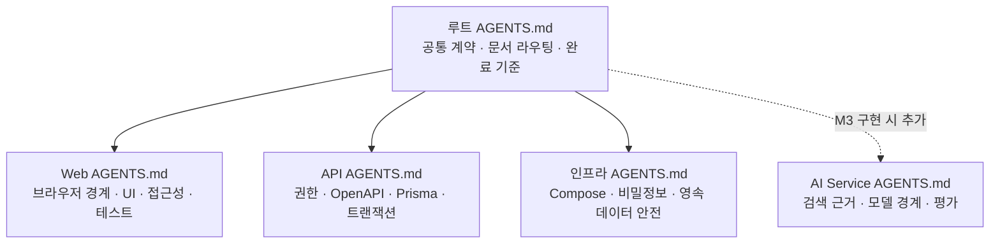

# AGENTS.md 계층과 바이브 코딩 운영

## 목표

qqup에서는 AI 보조 개발의 속도를 활용하면서도 세션마다 범위, 아키텍처와 검증 기준이 달라지는 문제를 줄이기 위해 작업 규칙을 저장소에 버전 관리한다. 대화 내용에만 의존하는 기억이 아니라 코드와 함께 검토·변경할 수 있는 실행 정책으로 다룬다.

## 규칙 계층

실제 private 소스 저장소의 규칙은 다음 책임으로 나뉜다.

루트에는 모든 변경에 적용되는 최소 공통 규칙과 전문 문서의 위치를 둔다. 서비스별 파일은 해당 경로에서만 필요한 제약을 추가한다. 아직 실제 기능을 구현하지 않는 영역은 세부 규칙 파일을 미리 만들지 않는다.

## Codex의 로딩 방식과 프로젝트 보완

[OpenAI의 공식 AGENTS.md 안내](https://learn.chatgpt.com/docs/agent-configuration/agents-md)에 따르면 Codex는 실행할 때 프로젝트 루트에서 현재 작업 디렉터리까지 규칙 파일을 합치며, 더 가까운 파일의 지침을 나중에 적용한다. 기본 합산 한도는 32KiB다.

qqup의 루트 규칙과 가장 큰 서비스 규칙의 합은 이 한도 안에 유지한다. 또한 작업을 저장소 루트에서 시작하는 경우에도 대상 경로의 하위 규칙을 놓치지 않도록, 루트 `AGENTS.md`가 Web·API·인프라 파일을 변경하기 전에 가장 가까운 `AGENTS.md`를 직접 읽도록 요구한다. 즉, 공식 자동 탐색 계층에 프로젝트 내부 라우팅 규칙을 더한 구조다.

### 루트 규칙의 역할

- 기존 작업과 사용자 변경 보존
- 요청 범위, 자율 변경과 사전 확인이 필요한 변경 구분
- Web·Core API·AI Service의 배포·신뢰 경계 유지
- 보안 공용화와 일반 추상화의 도입 시점 구분
- 변경 종류별 테스트와 완료 보고 기준
- 제품·도메인·보안·DB·진행 문서로의 라우팅

### 경로별 규칙의 역할

| 범위       | 추가하는 규칙                                                      | 분리 이유                                                        |
| ---------- | ------------------------------------------------------------------ | ---------------------------------------------------------------- |
| Web        | 서버 전용 정보 차단, API 계약 사용, 접근성·UI 상태와 브라우저 검증 | 화면 편의 때문에 서버 권한을 우회하지 않도록 함                  |
| Core API   | 인증·인가, 소유권, OpenAPI 원본, Prisma 마이그레이션과 트랜잭션    | 데이터와 공개 계약의 최종 판단 지점을 고정함                     |
| 인프라     | Compose 안전, 비밀정보, 포트, 볼륨과 운영 DB 경계                  | 개발 편의 명령이 영속 데이터나 운영 설정에 영향을 주지 않도록 함 |
| AI Service | 근거 검색, 모델 입력·출력, 평가와 실패 격리                        | 실제 AI 기능을 시작할 때 구체적인 위험과 검증 기준으로 추가 예정 |

## 문서 라우팅

`AGENTS.md` 하나에 모든 제품 지식을 넣으면 길어지고 서로 다른 종류의 사실이 섞인다. 그래서 규칙 파일은 “어떻게 작업할지”를 정의하고, 다음 전문 문서를 작업 종류에 따라 선택하도록 안내한다.

| 문서 역할       | 관리하는 내용                                          |
| --------------- | ------------------------------------------------------ |
| 제품 청사진     | 장기 비전, AI 기억·모순 검사와 이미지 생성의 후속 설계 |
| 기획 결정       | 확정·권장·보류된 제품 정책과 결정 시점                 |
| 프로젝트 진행   | 현재 마일스톤, 완료 조건, 차단 요소와 다음 작업        |
| 사용자 흐름     | 사용자 역할별 성공·실패 경로와 화면 책임               |
| 도메인 모델     | 작품·회차·캐릭터·사건의 관계와 불변 조건               |
| 엔지니어링 원칙 | 서비스 경계, 공용화 시점과 기술 제안 평가              |
| 보안·DB 설계    | 인증·인가 신뢰 경계와 운영 데이터베이스 책임           |

문서를 공개 저장소에 그대로 복사하지는 않는다. 포트폴리오에는 구조와 선택 이유만 설명하고, 실제 내용은 private 원본에서 단일 관리한다.

## 한 작업의 흐름

사용자 제안도 자동으로 승인하지 않는다. 다음 항목이 실질적으로 달라지면 원안의 장점과 우려, 권장안과 비용을 먼저 설명한다.

- 현재 마일스톤의 사용자 가치
- 실제로 확인된 사용처와 문제인지 여부
- 복잡도와 장기 유지보수 비용
- 보안·개인정보·운영 영향
- 데이터·공개 계약과 되돌리기 가능성
- 공식 지원 상태와 전환 비용

## 공용화 기준

모든 중복을 즉시 공용화하지 않는다.

- 인증, 인가와 작품 소유권처럼 한 번의 누락도 취약점이 되는 불변 규칙은 첫 사용처부터 중앙화한다.
- 오류 형식, 감사 로그와 속도 제한 같은 횡단 정책은 첫 소비자와 다음 소비자가 구체화됐을 때 경계를 검토한다.
- 일반 기술 반복은 같은 형태가 실제로 두 번 나타난 뒤 추출한다.
- 도메인 규칙은 의미가 사라지는 범용 유틸리티보다 해당 도메인 내부에 먼저 둔다.

이 기준은 “무조건 공용화”와 “복사 후 방치” 사이에서 보안 일관성과 과도한 추상화 비용을 함께 관리하기 위한 것이다.

## 검증 가능한 완료

파일이 생성됐다는 사실만으로 작업을 완료 처리하지 않는다. 변경 종류에 맞는 포맷, 린트, 타입 검사, 테스트, 빌드와 생성 계약 차이를 확인하고, 실행하지 못한 검사는 이유와 남은 위험을 기록한다. 중요한 상태 변화만 진행 문서에 남겨 다음 세션에서도 같은 완료 기준을 사용할 수 있게 한다.

이 구조의 목적은 AI가 판단을 대신하게 만드는 것이 아니라, 판단 근거·책임 경계·검증 결과를 사람이 다시 검토할 수 있게 만드는 것이다.
